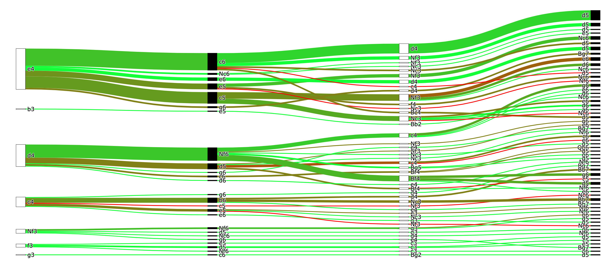

# Chess Repertoire Explorer
Prioritize your chess opening study by seeing which lines occur most oftens in your game, and how well you score with each line, all from a single chart. Try out the [app](https://chess-repertoire-explorer.herokuapp.com/) or read the [blog post](https://natesolon.github.io/blog/tree) to learn more.

